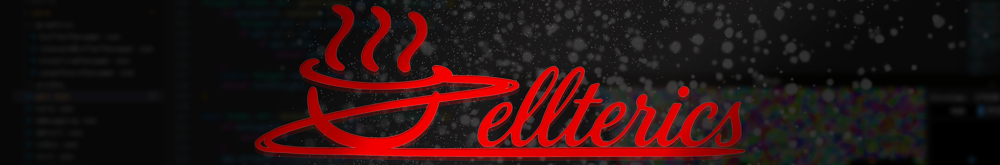

C++ Enjoyer • Computer Graphics • Vulkan • Engine Dev, best enemy of [@Civer_mau](https://github.com/Civermau)
getting into computer graphics using the Vulkan API on C++, I'm currently making a 2D engine to port and make new projects using graphics instead of console.
# About Me
I’ve been learning and working with **C++ for about 4 years**, mostly through personal projects. I enjoy exploring modern language features, low-level systems, and performance-oriented design.

Most of my work has been focused on C++ console projects such as:
- [Graphs](https://github.com/Zellterics/Graphs)
- [Text Novel Engine](https://github.com/Zellterics/VirtualFileSystem-NMT-) 
- [Virtual File System](https://github.com/Zellterics/TNGraphEngine) 

I also have some experience with C# including projects like a [map loader](https://github.com/Zellterics/JustAnEpicTest) for a console base game.

I've been learning computer graphics to port and expand some of this projects into graphical applications.

I also have basic knowledge of **web development, JavaScript, and Python**, and I plan to learn **Java** soon but C++ remains my main focus.
# Technologies
- Vulkan
- ImGui
- Cmake
- Arch Linux

  
  

# Current Project: [ThING Engine](https://github.com/Zellterics/ThING-Engine)
ThING Engine is a 2D Graphics Engine made for custom projects focusing on performance and flexibility for my projects.

**Features:**
- Fast circle, polygon and line rendering.
- Up to 30k.
- Up to **~500k rendered circles**.
- Built with **Vulkan** and **ImGui**.

The goal is to eventually make it **header-only or a static library**, once the architecture is fully polished.

### Contact Info
zellterics@gmail.com, Discord (zellterics).
